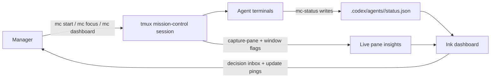

# Codex Mission Control

Open-source, tmux-first mission control for coordinating multiple Codex agents from one manager console.

This project is built around a simple idea: agent quality is not just about how well one agent reasons, but how clearly multiple agents can report progress, ask for decisions, and hand control back to a human when it matters. Codex Mission Control makes that coordination visible.

## Why This Exists

Most multi-agent demos focus on autonomy. Real work usually breaks on coordination:

- agents drift away from the current objective
- important decisions stay buried in terminal scrollback
- status updates are inconsistent across sessions
- the manager has no compact view of what needs attention right now

Codex Mission Control treats those coordination problems as first-class product surface.

## What It Demonstrates

- structured per-agent status files with explicit objective, current location in the process, and manager request
- a decision inbox that merges explicit `mc-status` requests with live terminal-derived approval prompts
- terminal attention routing from tmux bell, activity, silence, and pane text inspection
- optional per-agent git worktrees so parallel agents can operate without stepping on each other
- a live Ink dashboard that gives the manager one place to monitor the whole mission

## Architecture



## Requirements

- Node.js 20+
- tmux for the full multi-window workflow
- Codex CLI on `PATH` for automated agent startup via `mc start`

The structured status flow still works without tmux, which makes local testing and CI straightforward.

## Install

```bash
npm install
npm run build
npm link
```

## Quickstart

```bash
mc init
mc day start --goals "Ship release notes;Validate dashboard;Polish docs"
mc start reviewer --goal "Validate decision inbox"
mc start docs --goal "Tighten README and examples"
mc dashboard
```

The default manager loop is:

1. Start a mission day with a handful of concrete goals.
2. Start agents with optional goals or worktrees.
3. Let agents update their structured status with `mc-status`.
4. Use the dashboard to spot blockers, feedback requests, and stale sessions.

## Commands

- `mc init`
- `mc day start --goals "A;B;C"`
- `mc start <agent> [--goal "..."] [--worktree <name>]`
- `mc dashboard` or just `mc`
- `mc list`
- `mc focus <agent>`
- `mc attach`
- `mc ping <agent>` or `mc ping --all`

Status helper:

- `mc-status set --agent <name> --state running --summary "..."`
- `mc-status need-input --agent <name> --question "..." --where "..."`
- `mc-status decision --agent <name> --request "..." --where "..."`
- `mc-status done --agent <name> --last-done "..."`

## Coordination Model

Every agent writes a status file at `.codex/agents/<agent>/status.json`.

```json
{
  "schema_version": "1",
  "agent": "agent-auth",
  "goal": "Fix login redirect bug",
  "state": "running",
  "last_done": "",
  "next": "Investigate middleware",
  "needs_input": false,
  "question": "",
  "summary": "Tracing auth callback",
  "progress": 35,
  "manager": {
    "objective": "Fix login redirect bug",
    "where": "Validated callback path, comparing cookie behavior",
    "request": ""
  },
  "updated_at": "2026-02-28T10:00:00.000Z",
  "artifacts": {
    "branch": "codex/agent-auth",
    "worktree_path": "/path/to/worktree",
    "last_commit": "abc1234",
    "git_dirty": true,
    "tests": "unknown"
  }
}
```

Manager-facing fields:

- `goal` and `manager.objective`: what the agent is trying to accomplish
- `manager.where`: where the agent currently is in the process
- `manager.request` or `question`: the exact decision or feedback request that needs attention

## Dashboard Behavior

- `Decision Inbox` shows agents blocked on manager input with objective, process location, and request.
- `Decision Inbox` also promotes terminal-derived feedback requests, including interactive command approval prompts.
- `Terminal Attention` shows tmux `bell`, `activity`, and `silence` flags plus inferred feedback state from live pane text.
- `Update Pings` shows recent live updates and rings a terminal bell when new progress is detected.
- `Selected Agent` shows the full coordination context for the focused agent.
- `Daily Goals` combines mission-file goals with live per-agent task summaries.

## Worktrees

`mc start <agent> --worktree <name>` creates or reuses a dedicated git worktree for that agent on a `codex/<agent>` branch. This keeps concurrent changes isolated while still reporting status to the shared `.codex` control plane.

## Demo Loop

1. Start two agents.
2. Run `mc-status decision --agent agent-a --where "Ready to wire provider in login callback" --request "Choose OAuth provider: Auth0 or Clerk?"`.
3. Observe the request in `mc dashboard`.
4. Resolve it and run `mc-status set --agent agent-a --state running --clear-needs-input --summary "Resumed with Auth0" --where "Implementing provider wiring"`.
5. Finish with `mc-status done --agent agent-a --last-done "Merged changes"`.

## Development

```bash
npm install
npm test
npm run build
```

The test suite includes unit coverage for schema and tmux insight parsing plus integration coverage for:

- mission bootstrapping without tmux
- agent startup and status updates
- git worktree creation and reuse

## Contributing

See [CONTRIBUTING.md](./CONTRIBUTING.md) for local setup, testing expectations, and PR guidance.

## Limitations

- tmux is currently the only session manager integration.
- live attention inference is intentionally heuristic and based on terminal text, not deep agent instrumentation.
- the project is optimized for terminal-first manager workflows rather than browser-based orchestration.
