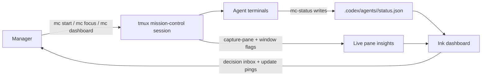

# Codex Mission Control

**Open-source, tmux-first mission control for coordinating multiple Codex agents with human-in-the-loop visibility.**

Codex Mission Control turns a set of agent terminals into one manageable workflow. It gives a human operator a live decision inbox, shared goals, agent progress, terminal attention signals, and optional worktree isolation—without moving the work out of the command line.

```text
Start mission -> Delegate work -> Watch progress -> Resolve decisions -> Ship
```

## The Problem

Running one agent is straightforward. Coordinating several is an operations problem.

- Progress is scattered across terminal scrollback.
- Requests for approval or product decisions can sit unnoticed.
- Agents describe status differently, making the overall mission hard to scan.
- Parallel changes can collide when every agent shares one checkout.
- More autonomy does not help when the human cannot tell where attention is needed.

Codex Mission Control treats coordination—not model capability—as the product surface. The dashboard compresses many active sessions into the few signals a manager needs to decide what to inspect, unblock, or redirect next.

## Product Principles and Decisions

### Route attention, not just activity

The primary dashboard surface is a `Decision Inbox`, not a wall of terminal output. Explicit agent requests and inferred terminal approval prompts are promoted above routine activity so the operator can focus on work that requires judgment.

### Combine declared state with observed behavior

Agents publish structured state through `mc-status`, while Mission Control also observes tmux flags and recent pane text. Structured status provides a durable coordination contract; live terminal signals help catch requests that have not yet been written to that contract.

### Keep the control plane local and inspectable

The system uses tmux, JSON files, Git, and two small CLIs. The operator can inspect the same status artifacts the dashboard reads, and the structured status flow remains usable without tmux for local testing and CI.

### Make isolation opt-in

An agent can work in the current checkout or start in a dedicated Git worktree. Teams can add isolation where concurrent changes warrant it without making every task pay the setup cost.

## What It Demonstrates

- **Developer-platform thinking:** a small, explicit status schema coordinates agents, the dashboard, and the human manager.
- **Human-in-the-loop product design:** decisions and feedback requests are separated from background execution.
- **Operational tooling:** tmux session management, live pane inspection, update pings, and worktree setup are integrated into one loop.
- **Pragmatic system design:** durable status and heuristic terminal inference complement each other instead of pretending either signal is complete.
- **End-to-end execution:** the project ships as a typed Node.js CLI with an Ink dashboard, schema validation, unit tests, and integration tests.

## Architecture



## Requirements

- Node.js 20+
- tmux for the full multi-window workflow
- Codex CLI on `PATH` for automated agent startup via `mc start`

The structured status flow still works without tmux, which makes local testing and CI straightforward.

## Install

```bash
npm install
npm run build
npm link
```

## Quickstart

```bash
mc init
mc day start --goals "Ship release notes;Validate dashboard;Polish docs"
mc start reviewer --goal "Validate decision inbox"
mc start docs --goal "Tighten README and examples"
mc dashboard
```

The default manager loop is:

1. Start a mission day with a handful of concrete goals.
2. Start agents with optional goals or worktrees.
3. Let agents update their structured status with `mc-status`.
4. Use the dashboard to spot blockers, feedback requests, and stale sessions.

## Demo Loop

This short loop exercises the central human-in-the-loop workflow:

1. Start two agents.
2. Run `mc-status decision --agent agent-a --where "Ready to wire provider in login callback" --request "Choose OAuth provider: Auth0 or Clerk?"`.
3. Observe the request in `mc dashboard`.
4. Resolve it and run `mc-status set --agent agent-a --state running --clear-needs-input --summary "Resumed with Auth0" --where "Implementing provider wiring"`.
5. Finish with `mc-status done --agent agent-a --last-done "Merged changes"`.

The dashboard moves the agent from active work, to a visible decision request, back to execution, and finally to completion without requiring the manager to reconstruct state from terminal history.

## Commands

- `mc init`
- `mc day start --goals "A;B;C"`
- `mc start <agent> [--goal "..."] [--worktree <name>]`
- `mc dashboard` or just `mc`
- `mc list`
- `mc focus <agent> [--switch]`
- `mc attach`
- `mc ping <agent>` or `mc ping --all`

Status helper:

- `mc-status set --agent <name> --state running --summary "..."`
- `mc-status need-input --agent <name> --question "..." --where "..."`
- `mc-status decision --agent <name> --request "..." --where "..."`
- `mc-status done --agent <name> --last-done "..."`

## Coordination Model

Every agent writes a status file at `.codex/agents/<agent>/status.json`.

```json
{
  "schema_version": "1",
  "agent": "agent-auth",
  "goal": "Fix login redirect bug",
  "state": "running",
  "last_done": "",
  "next": "Investigate middleware",
  "needs_input": false,
  "question": "",
  "summary": "Tracing auth callback",
  "progress": 35,
  "manager": {
    "objective": "Fix login redirect bug",
    "where": "Validated callback path, comparing cookie behavior",
    "request": ""
  },
  "updated_at": "2026-02-28T10:00:00.000Z",
  "artifacts": {
    "branch": "codex/agent-auth",
    "worktree_path": "/path/to/worktree",
    "last_commit": "abc1234",
    "git_dirty": true,
    "tests": "unknown"
  }
}
```

Manager-facing fields:

- `goal` and `manager.objective`: what the agent is trying to accomplish
- `manager.where`: where the agent currently is in the process
- `manager.request` or `question`: the exact decision or feedback request that needs attention

## Dashboard Behavior

- `Decision Inbox` shows agents blocked on manager input with objective, process location, and request.
- `Decision Inbox` also promotes terminal-derived feedback requests, including interactive command approval prompts.
- `Terminal Attention` shows tmux `bell`, `activity`, and `silence` flags plus inferred feedback state from live pane text.
- `Update Pings` shows recent live updates and rings a terminal bell when new progress is detected.
- `Selected Agent` shows the full coordination context for the focused agent.
- `Daily Goals` combines mission-file goals with live per-agent task summaries.

## Worktrees

`mc start <agent> --worktree <name>` creates or reuses a dedicated Git worktree for that agent on a `codex/<agent>` branch. This keeps concurrent changes isolated while still reporting status to the shared `.codex` control plane.

## Development

```bash
npm install
npm test
npm run build
```

The test suite includes unit coverage for schema and tmux insight parsing plus integration coverage for:

- mission bootstrapping without tmux
- agent startup and status updates
- Git worktree creation and reuse

## Contributing

See [CONTRIBUTING.md](./CONTRIBUTING.md) for local setup, testing expectations, and PR guidance.

## Limitations

- tmux is currently the only session manager integration.
- Live attention inference is intentionally heuristic and based on terminal text, not deep agent instrumentation.
- The project is optimized for terminal-first manager workflows rather than browser-based orchestration.

## Author

Built and maintained by [Anthony Isaakidis](https://github.com/anthonyisaa) as an open-source exploration of how product leaders can coordinate agentic software work while keeping human judgment visible in the loop.
